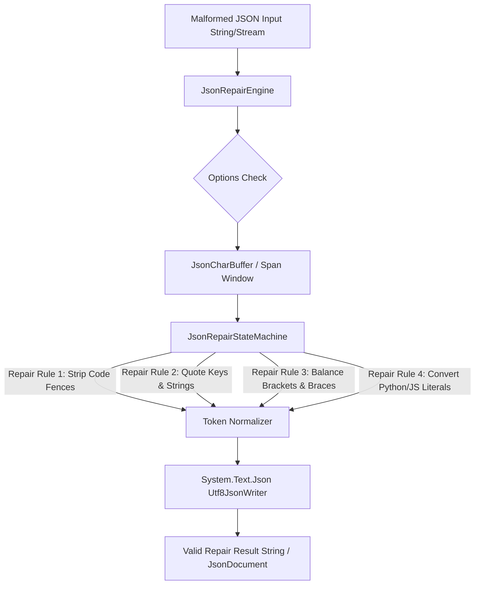

# JsonRepair.NET: Vision and Architecture Specification (.NET 10)

## 1. Vision Statement

**`JsonRepair.NET`** aims to be the standard, ultra-fast, zero-allocation JSON repair engine for the .NET ecosystem.

Large Language Models (LLMs) frequently generate malformed, truncated, or syntactically invalid JSON output due to token limits, prompt artifacts, markdown formatting, or non-standard syntax (such as Python `None`/`True`/`False`, unquoted keys, single quotes, or unescaped control characters). Standard JSON parsers like `System.Text.Json` strictly reject these inputs by throwing `JsonException`.

`JsonRepair.NET` bridges this gap by automatically fixing invalid JSON syntax into strictly conforming, valid JSON while preserving data semantics.

---

## 2. Architecture & Design Principles

### 2.1 High Performance & Low Allocation Design
- **`ReadOnlySpan<char>` Tokenization**: Processes strings without string allocation per token.
- **Ref Struct Parsing Engine**: The core parsing loop uses `ref struct JsonRepairStateMachine` to eliminate object allocation on the managed heap during state transitions.
- **Zero-Allocation Stack / ArrayPool Buffers**: Uses `Span<char>` or rented arrays from `ArrayPool<char>.Shared` for character transformation and output generation.
- **Direct Integration with `System.Text.Json`**: Exposes seamless extension methods on `JsonDocument`, `JsonNode`, and `JsonSerializer`.

### 2.2 System Component Diagram



---

## 3. Supported Repair Scenarios

`JsonRepair.NET` handles a wide spectrum of malformed JSON conditions:

1. **Markdown Code Fences**: Strips ` ```json ` and ` ``` ` headers/footers automatically.
2. **Quote Normalization**: Converts single quotes `'key': 'value'` to double quotes `"key": "value"`.
3. **Unquoted Keys**: Wraps unquoted object keys (`{name: "Alice"}`) in double quotes (`{"name": "Alice"}`).
4. **Python & JS Literals**: Converts `None` $\rightarrow$ `null`, `True` $\rightarrow$ `true`, `False` $\rightarrow$ `false`, `undefined` $\rightarrow$ `null`, `NaN` $\rightarrow$ `null`.
5. **Trailing Commas**: Strips trailing commas in objects (`{"a": 1,}`) and arrays (`[1, 2,]`).
6. **Missing Commas**: Inserts missing commas between key-value pairs or array items (`{"a": 1 "b": 2}`).
7. **Unclosed Structures (Truncated JSON)**: Automatically inserts missing closing brackets `]` and braces `}` for truncated LLM responses.
8. **Unescaped Characters**: Automatically escapes literal newlines, tabs, and unescaped double quotes inside strings.
9. **Concatenated / Extra Content**: Removes leading or trailing commentary outside the primary JSON object/array.
10. **Comments**: Strips single-line (`// ...`) and multi-line (`/* ... */`) comments.

---

## 4. Public API Specification

```csharp
namespace JsonRepair;

public static class JsonRepairEngine
{
    /// <summary>
    /// Repairs a malformed JSON string into valid, standardized JSON.
    /// </summary>
    public static string Repair(string json, JsonRepairOptions? options = null);

    /// <summary>
    /// Repairs a malformed JSON character span into the target span buffer.
    /// </summary>
    public static int Repair(ReadOnlySpan<char> source, Span<char> destination, JsonRepairOptions? options = null);

    /// <summary>
    /// Tries to repair malformed JSON and parse directly as a JsonDocument.
    /// </summary>
    public static bool TryParse(string malformedJson, out JsonDocument? document, JsonRepairOptions? options = null);
}
```
