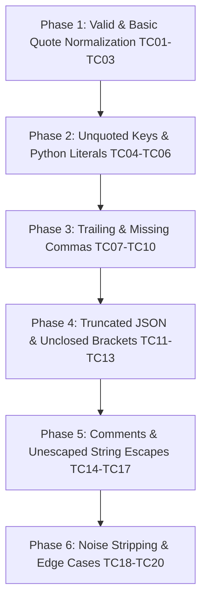

# JsonRepair.NET: TDD Test Suite & Matrix (.NET 10)

## Overview

This Test-Driven Development (TDD) roadmap defines the full matrix of unit, integration, and edge-case test specifications for **`JsonRepair.NET`**. The test suite guarantees correctness across all malformed JSON patterns emitted by Large Language Models (LLMs) and legacy APIs.

Testing stack:
- **`xUnit`** (v2.9+)
- **`FluentAssertions`** (v7.x / v8.x)

---

## TDD Test Case Matrix

| ID | Test Category | Input Example | Expected Output | Status |
| :--- | :--- | :--- | :--- | :--- |
| **TC01** | Standard Valid JSON | `{"name": "John", "age": 30}` | `{"name": "John", "age": 30}` | Planned |
| **TC02** | Markdown Fences | ```json\n{"a": 1}\n``` | `{"a": 1}` | Planned |
| **TC03** | Single Quotes (Keys & Values) | `{'key': 'value'}` | `{"key": "value"}` | Planned |
| **TC04** | Unquoted Keys | `{foo: "bar", age: 25}` | `{"foo": "bar", "age": 25}` | Planned |
| **TC05** | Python Literals (`None`, `True`, `False`) | `{"active": True, "data": None}` | `{"active": true, "data": null}` | Planned |
| **TC06** | JS Literals (`undefined`, `NaN`) | `{"val": undefined, "num": NaN}` | `{"val": null, "num": null}` | Planned |
| **TC07** | Trailing Commas in Objects | `{"a": 1, "b": 2,}` | `{"a": 1, "b": 2}` | Planned |
| **TC08** | Trailing Commas in Arrays | `[1, 2, 3,]` | `[1, 2, 3]` | Planned |
| **TC09** | Missing Commas in Objects | `{"a": 1 "b": 2}` | `{"a": 1, "b": 2}` | Planned |
| **TC10** | Missing Commas in Arrays | `[1 2 3]` | `[1, 2, 3]` | Planned |
| **TC11** | Unclosed Array (Truncated) | `[1, 2, 3` | `[1, 2, 3]` | Planned |
| **TC12** | Unclosed Object (Truncated) | `{"a": 1, "b": {"c": 2` | `{"a": 1, "b": {"c": 2}}` | Planned |
| **TC13** | Truncated String Value | `{"message": "hello wor` | `{"message": "hello wor"}` | Planned |
| **TC14** | Single-line Comments | `{"a": 1 // comment\n}` | `{"a": 1}` | Planned |
| **TC15** | Multi-line Comments | `{"a": /* note */ 1}` | `{"a": 1}` | Planned |
| **TC16** | Unescaped Newlines in Strings | `{"text": "line1\nline2"}` | `{"text": "line1\\nline2"}` | Planned |
| **TC17** | Unescaped Double Quotes in Strings | `{"text": "He said "hello""}` | `{"text": "He said \"hello\""}` | Planned |
| **TC18** | Leading / Trailing Noise Text | `Here is the JSON: {"a": 1} Hope it helps!` | `{"a": 1}` | Planned |
| **TC19** | Empty Input / Whitespace | ` ` or `""` | `{}` | Planned |
| **TC20** | Mixed Special Character Escapes | `{'path': 'C:\\Users\\test'}` | `{"path": "C:\\Users\\test"}` | Planned |

---

## TDD Implementation Order


