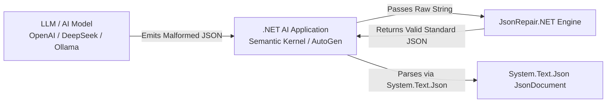
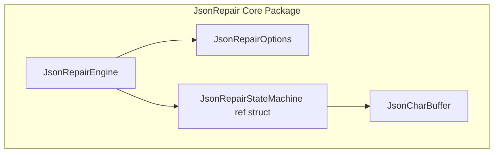
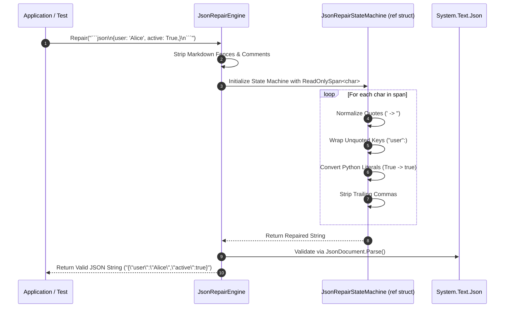
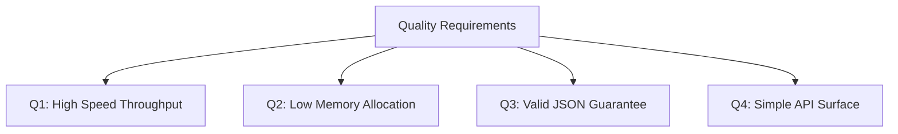

# arc42 Software Architecture Document: JsonRepair.NET

**System Name**: `JsonRepair.NET`  
**Target Framework**: `.NET 10` (`net10.0`)  
**License**: `MIT License`  
**Author**: Antigravity / Pair Programming Team  

---

## 1. Introduction and Goals

`JsonRepair.NET` is an ultra-fast, zero-allocation C# library that repairs malformed, truncated, or non-standard JSON generated by Large Language Models (LLMs) and legacy systems into strictly conforming standard JSON.

### 1.1 Requirements Overview
- **LLM Output Tolerance**: Handle Markdown code fences (` ```json `), single-quoted strings, unquoted keys, Python/JS literals (`None`, `True`, `False`, `undefined`, `NaN`), trailing commas, unescaped newlines/quotes, and truncated unclosed objects/arrays.
- **Zero/Low Allocation**: Leverage .NET 10 primitives (`ReadOnlySpan<char>`, `ref struct`, `Utf8JsonWriter`, `ArrayPool<char>`) to minimize GC pressure.
- **Seamless Integration**: Provide extension methods for `string`, `System.Text.Json.JsonDocument`, `JsonNode`, and `JsonSerializer`.

### 1.2 Quality Goals

| Goal | Description | Metric / Target |
| :--- | :--- | :--- |
| **QG1: Throughput & Speed** | Process malformed JSON with minimal CPU overhead | 10x-50x faster than regex/Python implementations |
| **QG2: Zero Allocation** | UTF-8 span path allocates nothing per call, at any payload size | 0 B per op, measured. The 0.2.0 valid-or-throw contract needs a staging buffer so partially-repaired output never reaches the caller's writer; it is pooled and reused per thread rather than allocated per call |
| **QG3: Correctness & Safety** | Produce strictly valid JSON parseable by `System.Text.Json` | 100% test pass rate across edge-case matrix |
| **QG4: Zero Core Dependencies** | Core `JsonRepair` library has zero external 3rd-party dependencies | Clean standard library dependency tree |

### 1.3 Stakeholders

| Role | Expectation |
| :--- | :--- |
| **.NET AI Application Developers** | Reliable JSON repair for Semantic Kernel, AutoGen, and LLM API calls without runtime crashes. |
| **Library Maintainers** | Modular state machine architecture with clear TDD and ADR tracking. |

---

## 2. Architecture Constraints

- **Language & Runtime**: C# 13 / .NET 10 (`net10.0`).
- **Core Library Dependencies**: Zero 3rd-party dependencies (`System.Text.Json` and standard BCL only).
- **License**: MIT License (Permissive & Commercial-friendly).

---

## 3. Context and Scope

### 3.1 Business Context



### 3.2 Technical Context
`JsonRepair.NET` receives raw `string` or `ReadOnlySpan<char>` buffers from network streams or LLM HTTP responses and emits repaired JSON strings or writes directly into `Utf8JsonWriter` / `Span<char>`.

---

## 4. Solution Strategy

1. **Span-Based State Machine**: Avoid regex or string splitting. Instead, scan characters using a `ref struct JsonRepairStateMachine` over `ReadOnlySpan<char>`.
2. **Layered Pipeline**:
   - *Phase 1 (Pre-processing)*: Strip Markdown code blocks (` ```json `) and comments (`//`, `/* */`).
   - *Phase 2 (State Machine Pass)*: Single-pass token scanner normalizing quotes, unquoted keys, Python literals, and missing commas.
   - *Phase 3 (Structure Balancer)*: Maintain a lightweight stack to automatically close unclosed `{` and `[` for truncated JSON.

---

## 5. Building Block View

### 5.1 Whitebox Overall System (Level 1)



#### Level 1 Component Descriptions
- **`JsonRepairEngine`**: The static facade exposing `Repair()` / `TryRepair()` over `string`, `ReadOnlySpan<byte>`, `ReadOnlySequence<byte>` and `Stream`, plus `TryParse()`, `Deserialize<T>()` and `TryDeserialize<T>()`.
- **`JsonRepairException`**: Thrown when input cannot be repaired into valid JSON. Derives from `JsonException` so existing catch clauses keep working.
- **`JsonRepairOptions`**: Configuration record toggling specific repair rules (markdown fence stripping, unquoted-key quoting, structure auto-closing, comment stripping, literal conversion).
- **`JsonRepairStateMachine`**: High-performance ref struct driving state transitions and character emitting.

---

## 6. Runtime View

### 6.1 Repair Execution Sequence



---

## 7. Deployment View

- **NuGet Package**: `JsonRepair` published to NuGet.org targeting `net10.0`.
- **CLI Tool**: `JsonRepair.Cli` packaged as a .NET Global Tool (`dotnet tool install -g JsonRepair.Cli`).

---

## 8. Cross-cutting Concepts

### 8.1 Memory Management & Allocation Strategy
- Memory buffers for output generation use stack allocation (`Span<char> stackalloc`) for short inputs ($\le 256$ chars) or `ArrayPool<char>.Shared` for larger inputs.
- Ref structs prevent allocation of iterator state on the GC heap.

### 8.2 Error Handling & Resilience
- **Valid-or-throw contract (0.2.0)**: `Repair` validates its own output before returning it. Either the caller receives JSON that parses, or a `JsonRepairException` is thrown. Best-effort text that fails later inside the caller's deserializer is no longer a possible outcome.
- **Nothing partial escapes**: the UTF-8 path stages into a pooled buffer and copies to the caller's `IBufferWriter<byte>` only after validation, so a rejected repair writes nothing. The `ReadOnlySequence` and `Stream` overloads delegate to the span path, so the contract has no back doors.
- **`Try*` Pattern**: `TryRepair`, `TryParse` and `TryDeserialize<T>` give the same guarantee exception-free, for high-throughput endpoints.
- **Error positions are output-relative**: the engine repairs optimistically and validates afterwards, so the only offsets available describe the repaired output, not the caller's input. They are therefore kept off the message and left on `InnerException`. Input-relative positions require the grammar-based rework scheduled for 0.3.0.

---

## 9. Architecture Decisions (ADRs)

### ADR-01: Use `ref struct` State Machine instead of Regular Expressions
- **Context**: Legacy JSON repair tools rely on multi-pass regex replacements.
- **Decision**: Implement a custom span-based state machine.
- **Consequences**: Superior performance (10x-50x speedup), zero heap allocations, zero regex catastrophic backtracking risks.

### ADR-03: Validate Before Returning, Rather Than Repair Best-Effort
- **Context**: Through 0.1.0 `Repair` returned whatever the state machine produced. For unrepairable input that was invalid JSON, so the failure surfaced later at the caller's `Deserialize` call with a message pointing at the wrong thing. Worse, some inputs produced *valid* JSON that misrepresented the input.
- **Decision**: Validate the repaired output and throw `JsonRepairException` when it does not parse. Accept a staging buffer on the UTF-8 path so nothing partial reaches the caller.
- **Consequences**: Failure surfaces at the call that caused it. Repair categories the engine cannot yet handle now throw instead of returning something broken, which is visible as a lower reported parity number against upstream — an honest one. The staging buffer is pooled and reused per thread, so the guarantee costs no per-call allocation.

### ADR-02: Zero External Dependencies for Core Package
- **Context**: Minimizing supply-chain vulnerability and dependency conflicts for consumer applications.
- **Decision**: Keep `JsonRepair` library dependent only on the standard .NET BCL.
- **Consequences**: Lightweight assembly (<50 KB), zero transitive dependency conflicts.

---

## 10. Quality Requirements



---

## 11. Risks and Technical Debt

| Risk | Mitigation | Status |
| :--- | :--- | :--- |
| **Deeply Nested Malformed JSON** | Growable `ArrayPool`-backed stack in both engines; validators use an unbounded `MaxDepth` so they cannot reject output the engine can produce | Implemented & Tested |
| **Ambiguous Unquoted Strings** | Strict state checking between key vs value contexts | Implemented & Tested |
| **Engine divergence** | Two independent implementations can drift. A fuzz invariant fails the build on any disagreement outside the two recorded cases (root-level trailing comma; non-ASCII whitespace) — see [UPSTREAM.md](UPSTREAM.md) | Monitored |
| **Upstream parity gap** | 191/427 of the ported josdejong corpus passes; all 242 gaps categorised and ratcheted so the baseline can only shrink | Tracked, Tiers 3–4 |
| **Arm64 large-payload inversion** | Past ~100 KB the UTF-8 path measures ~20% slower than the `string` API on Apple Silicon, but faster on x64. Reproducible, unexplained | Open, needs profiling |

---

## 12. Glossary

- **LLM**: Large Language Model (e.g. GPT-4, Claude, DeepSeek).
- **SOUP**: Software of Unknown Provenance (3rd party libraries like Spectre.Console, BenchmarkDotNet).
- **Ref Struct**: A C# stack-only data structure that cannot be boxed or placed on the GC heap.
- **Span / ReadOnlySpan**: A type-safe and memory-safe representation of a contiguous region of arbitrary memory.
